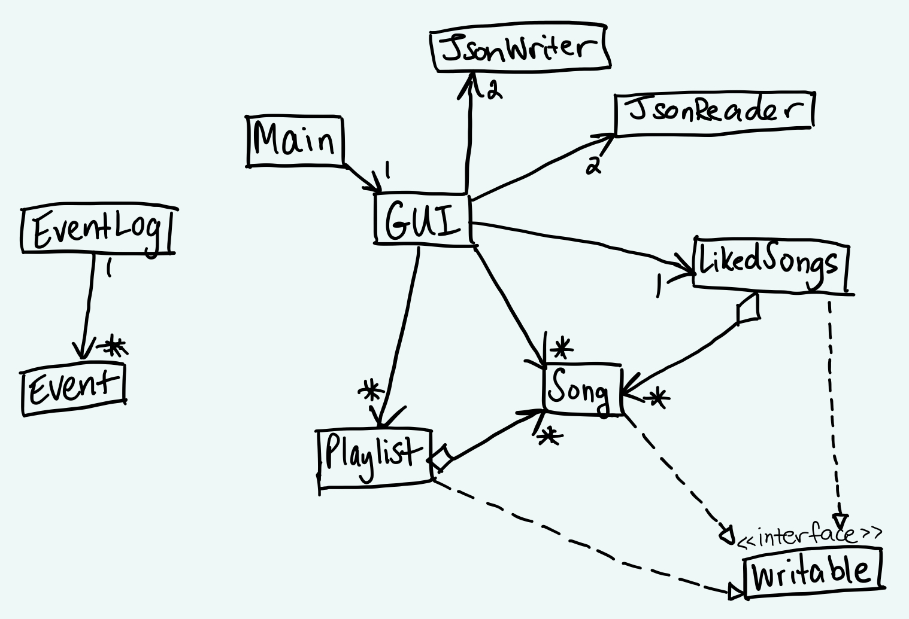

# My Personal Project

# Aariyana Sayani's Personal Project 

## Project Proposal - A Spotify Organizer

### *Basic Idea: An application that will organize/analyze a user's Spotify songs, genres, and playlists*

**Plan**:  
My plan is to create a Java Application that will organize a user's Spotify songs. The user will be able to filter their 
songs by genre, and make playlists based on those genres as well as find the genre that is most common among their saved 
songs. 

**What will the application do?** 
The application will allow users to operate on all of their liked songs in Spotify. Users will be able to filter their 
songs by genre and create playlists with songs corresponding to their genres. Users will also be able to view which
genre appears most commonly out of all their liked songs, and the length of any playlist they create. 

**Who will use it?** 
Spotify users

**Why is this project of interest to me?** 
I use Spotify on the daily and I have a large variety of liked songs (over 6,000!) so it would be neat to be able to
filter some of my songs based on genre and make them into playlists. It would save me a lot of trouble if I'm in a 
certain mood and want to make sure only a select set of songs play that fit my current mood (e.g. don't play any 
bubblegum pop when I'm depressed, only play instrumentals when I'm stressed, etc.) based on what genres I like when I'm 
in said mood. I know that would be useful for me and since almost every university student uses spotify to stream music
they would probably find something like this useful as well. 

### **User Stories**
***In the context of a Spotify organizer application:***
- As a user, I want to be able to add a song to my liked songs list
- As a user, I want to be able to remove a song from my liked songs list
- As a user, I want to be able to create a new playlist for a specific genre
- As a user, I want to be able to add a song to a playlist
- As a user, I want to be able to remove a song from a playlist
- As a user, I want to be able to save my playlist
- As a user, I want to be able to load my playlist from file
- As a user, I want to be able to view my liked songs 
- As a user, I want to be able to view my playlists

### Phase 4 - Task 3:
***UML class diagram:***

***Reflection: Is there anything I would change/refactoring?***

This project was challenging but rewarding and very fun. I enjoyed seeing the progress I made and everything come
in every phase. It especially fun making the GUI but also especially challenging, which made it quite interesting. 

In terms of what I might change next time, one thing I might do is make different classes for each button in my GUI so
that my code is more organized. That way I would have many smaller classes with less lines of code each rather than one
very large GUI class with over 300 lines of code.

Another thing I would do is to make a method that allows me to view my likedsongs and playlist right away, rather than
first implement methods that add to likedsongs and playlist and then implement methods that allow to view them, because
that way it's easier to debug so you can check right away whether they were added or not. 

Additionally, for specifically for my remove from liked songs button in the GUI, I might make it so that you can select
the song you want to remove by scrolling down the list and selecting it that way, rather than just pressing the button 
and having to type in the prompted boxes. This would be more straighforward and user friendly in functionality. 

Finally, I would probably spend some more time on my GUI, by adding some colour, playing with fonts and the layout of 
things more, to increase user friendliness. 

